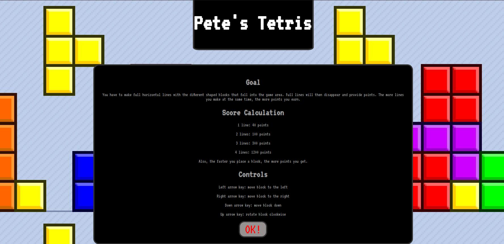
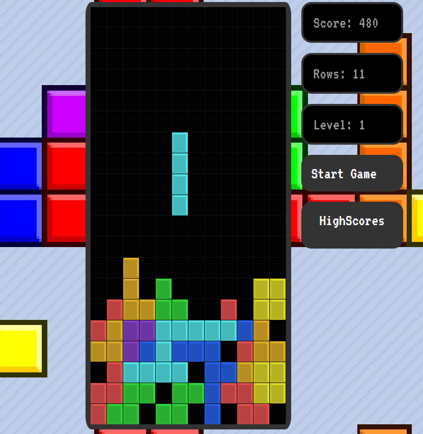
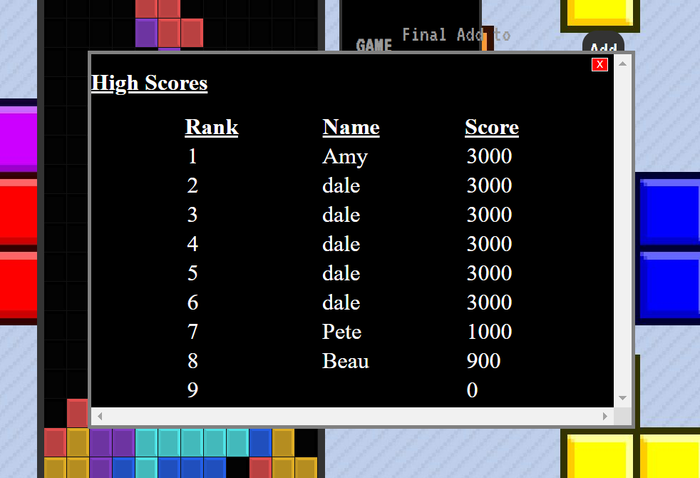

# Full Stack Tetris Game 

Technology Utilised:

- React + React Hooks + React Routing
- Database with SQL and Knex.js
- RESTful APIs/ Backend Routes with SuperAgent.js and Express.js
- CSS with Styled Components

** Added TypeScript to project for learning and practice

To spin up the app:

* Clone the repo into your drive
* npm i via chosen command line to install dependencies
* npm run dev to spin up server 
* Visit https://localhost:3000 to view app. 

Screen Shots: 

Instructions . . .

Game . . .

High Scores . . .

## GOAL 1 (Completed)

Scaffold tetris game components

## GOAL 2 (Completed)

Create Stage and Tetrominos logic

## GOAL 3 (Completed)

Add Styled Components - CSS structure to Tetris stage and display

## GOAL 4 (Completed)

Create usePlayer and useStage Hooks

## GOAL 5 (Completed)

Add tetromino movement logic

## GOAL 6 (Completed) 

Add Tetrominos collision detection logic

## GOAL 7 (Completed)

Add Tetrominos Rotation Logic 

## GOAL 8 (Completed)

Add Row Clear logic when row is completed

## GOAL 9 (Completed) 

Add Drop Timer Logic + Level Increase wiht useInterval Hooks

## GOAL 10 (Completed)

Add Scoring and Game Over logic 

## GOAL 11 (Completed)

Create Highscore SQL Database

## GOAL 12 (Completed)

Create getHighscores routes/ dbHelpers and APIs

## GOAL 13 (Completed)

Reformat GameOver component and create AddHighscore routes/ dbHelpers and APIs

## STRETCH 

- Pause Game functionality 
- Reformat Game Presentation
- Add further CSS to unstyled components and touch ups 
- Transform into mobile app with React Native 

